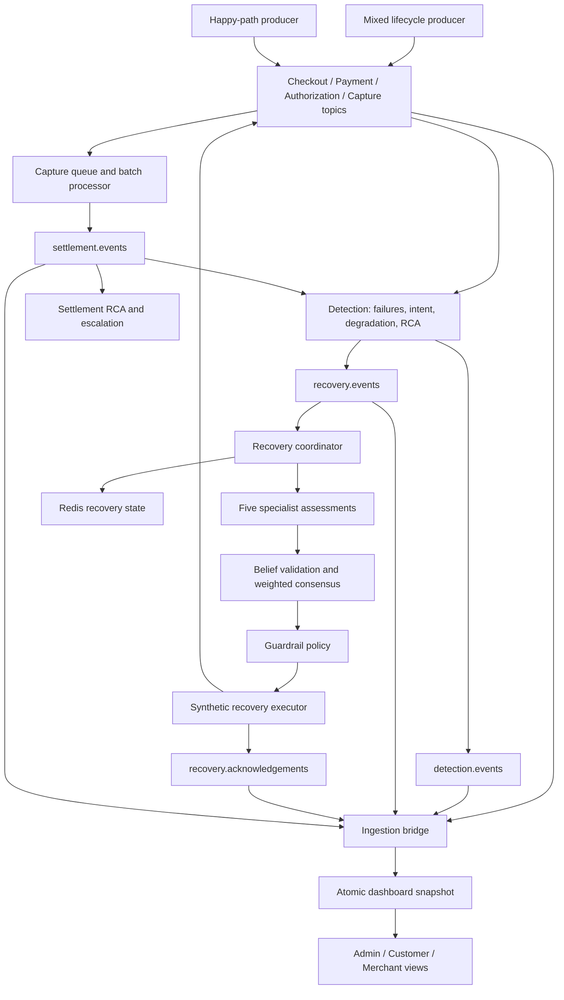

# RevTrace: AI Revenue Recovery Infrastructure

RevTrace is an event-driven payment observability and revenue recovery demo. It follows transactions from checkout through capture, detects failures, combines specialist agent assessments, applies recovery guardrails, and tracks settlement incidents through root-cause analysis and escalation.

The system continuously generates payment lifecycles, processes them through Kafka, and displays backend-derived results. Customer payment recovery and merchant settlement are separate workflows connected by successful captures.

**Current scope:** payment providers, recovery execution, payment-link interactions, and bank outcomes are synthetic. Kafka, Redis, gRPC, Splunk forwarding, and dashboard ingestion run as actual services. The demo does not send real customer notifications or transfer money.

## Architecture



The Splunk forwarder independently consumes all eight application topics through HEC. Producers and recovery/settlement components also write to a shared JSONL write-ahead log (WAL). These stores support different views of the system; they are not one distributed transaction.

## Layers

| Layer | Responsibility | Main implementation |
| --- | --- | --- |
| Generation | Continuous valid lifecycles, transaction identity, failure scenarios | `runner/mock_pipeline.py`, `common/event.py`, `common/ids.py` |
| Transport | Kafka topics, keyed records, independent consumer groups | `common/kafka.py`, `docker-compose.yml` |
| Detection | Contract validation, failures, intent, provider degradation, graph-based RCA | `detection/consumer/main.py`, `detection/detectors/`, `detection/rca/` |
| Agent coordination | Load state and collect five assessments concurrently | `recovery/coordinator/service.py` |
| Decision control | Validate beliefs, aggregate support, authorize actions | `recovery/consensus/engine.py`, `recovery/policy/engine.py` |
| Recovery | Simulate actions, follow-up events, and acknowledgements | `recovery/executor/engine.py`, `recovery/consumer/main.py` |
| Settlement | Queue captures, form batches, process outcomes, create incidents | `services/settlement/main.py`, `common/settlement.py` |
| Observability | Kafka snapshots, Splunk indexing, operational views | `runner/bridge_ingestion.py`, `consumers/main.py`, `dashboard/` |

## Payment Lifecycle and Topics

```text
checkout_started -> checkout_completed
  -> payment_created -> payment_succeeded
  -> authorization_requested -> authorization_succeeded
  -> capture_requested -> capture_succeeded (CAPTURED_FINAL)
```

A failure ends the source attempt. Recovery can initiate another attempt, preserving transaction/payment identity and recording attempt metadata. Captures enter settlement independently of subsequent source traffic.

Events carry transaction, payment, order, customer, merchant, trace, span, and event IDs, plus amount, currency, status, timestamp, and provider metadata. Producer restarts receive a fresh identity namespace. Explicit `MOCK_TRANSACTION_ID` overrides are intended for controlled tracing scenarios.

| Kafka topic | Content |
| --- | --- |
| `checkout.events` | Checkout starts, completions, and failures |
| `payment.events` | Payment attempts, outcomes, and link interactions |
| `authorization.events` | Authorization requests and outcomes |
| `capture.events` | Capture requests and outcomes |
| `settlement.events` | Batch readiness, processing, success, and failure |
| `detection.events` | Failure assessments and signals |
| `recovery.events` | Candidates submitted to recovery |
| `recovery.acknowledgements` | Decisions, execution results, and follow-up counters |

Successful source events contribute to detection state but do not become failure candidates. Detection preserves source identifiers so assessments remain traceable to their originating events.

## Agent Communication

The coordinator uses a hub-and-spoke topology. Agents return structured beliefs to the coordinator; they do not broadcast votes to one another or execute payments themselves. Five assessments are gathered concurrently using a thread pool.

| Agent | Assessment | Runtime communication | Voting weight |
| --- | --- | --- | --- |
| Intent | Customer history and willingness to retry | gRPC `Evaluate`, port 50051; local fallback on RPC failure | 1.0 |
| Provider | Gateway degradation and alternative availability | gRPC `Evaluate`, port 50052; local fallback on RPC failure | 1.0 |
| Transaction | Lifecycle state and applicable recovery action | Local function in coordinator | 1.2 |
| Economics | Expected recovery value, cost, and ROI | Local function in coordinator | 1.0 |
| Risk | Attempt count, duplicate/cooldown signals, risk indicators | Local function in coordinator | 1.3 |

The separately launched transaction, economics, and risk containers are debug/heartbeat processes. The active recovery path invokes their scoring functions locally. Intent and provider RPCs use two-second deadlines. Protobuf contracts and generated clients live in `recovery/api/`.

A belief contains:

```text
belief_id, agent_id, agent_version,
transaction_id, state_version,
recommendation, confidence, reason_code, timestamp, evidence
```

Redis stores versioned recovery state and candidate identity information. The recovery API exposes state for inspection, Kafka acknowledgements distribute results, and the WAL records intermediate assessments and decisions.

## BFT-Inspired Consensus

RevTrace implements **centralized, confidence-weighted voting with belief validation**, not formal Byzantine fault tolerant consensus or PBFT. Its BFT-inspired elements are rejection of invalid/stale votes, duplicate detection, agent quarantine, and a support threshold before authorization.

The validator checks agent allowlisting, transaction/state-version agreement, duplicate belief IDs, confidence bounds, evidence structure, and timestamp presence. Repeated invalid beliefs can quarantine an agent within the running validator instance. Timestamp presence is checked; cryptographic authenticity and timestamp freshness are not established.

```text
support(action) = sum(weight * confidence for valid supporting beliefs)
                  / sum(weight for all valid participating beliefs)
```

Defaults in `recovery/config.py` require at least **3 valid agents** and **0.67 support**. Insufficient evidence or no quorum produces `DO_NOTHING`. The pipeline can combine generic `RECOVER` support with support for a concrete action inferred from the transaction context.

The current demo also applies a checkout-specific transformation before aggregation: generic recovery votes become `SEND_PAYMENT_LINK`; an intent-agent `DO_NOTHING` vote is converted to that action with confidence floored at 0.75. This is an explicit demo policy override, not independent agent agreement, and it does not preserve a strict above-median-intent gate. Review this rule before using the decision system outside the demo.

There are no replicated consensus rounds, signed votes, Byzantine leader election, or proven `3f + 1` fault-tolerance guarantees. An individual negative vote is not a hard veto. Independent enforcement comes from the policy engine.

## Guardrails and Recovery

Consensus proposes an action; policy authorizes it. The policy records evaluated checks and stops at the first failure.

| Check | Default behavior |
| --- | --- |
| Kill switch | Block recovery when enabled |
| Consensus | Require quorum and configured support threshold |
| Action allowlist | Reject unsupported actions |
| Attempt limit | Require fewer than 3 previous recovery attempts |
| Amount limit | Require amount at or below 100,000 |
| Transaction state | Block already successful or recovered transactions |
| ROI | Require present expected ROI at or above 0 |
| Provider allowlist | Switches must target Gateway_A, Gateway_B, or Gateway_C |

The amount limit is a raw numeric demo limit; there is no currency conversion policy. Fraud, duplicate, and cooldown assessments also appear in risk-agent beliefs, but are not independent hard checks in this policy engine.

Actions include `SEND_PAYMENT_LINK`, `RETRY_PAYMENT`, `RETRY_CAPTURE`, and `SWITCH_PROVIDER`. Settlement retry/escalation primitives also exist; the live batch service generates incidents rather than automatically proving a bank retry succeeded.

The executor accepts policy-authorized commands and simulates execution. The consumer emits follow-up lifecycle events. A sent link is distinct from an opened link, a payment attempt, and a successful capture; acknowledgements expose these counters separately. Recovery revenue is reported from successful follow-up captures, not merely from sending a notification. Ordinary duplicate-candidate replay skips repeated follow-up execution.

## Settlement and Money Trail

Settlement queues successful `CAPTURED_FINAL` records. By default, each batch contains exactly **100 unique transactions**, and the service starts at most one batch every **60 seconds** when sufficient captures are available. Processing completes asynchronously after a **5-second** delay while normal traffic continues.

The default outcome pattern is `random,failed,random`: batch two fails, while other outcomes use a stable hash of the batch index. Later batches can also fail. Producer throughput and processing overhead determine when the queue reaches its threshold.

Every new batch carries a capture manifest with customer, merchant, order, payment, provider, timestamp, currency, and amount. The dashboard uses it when the source capture is unavailable. Failed batches retain their captured value, report unsettled funds at risk, and produce RCA evidence, escalation ownership, and bank complaint records. These incident artifacts are simulated, not externally sent messages.

The settlement view sorts batches by sequence, displays full waiting batches as READY, and retains one COLLECTING row even when empty. On restart the service replays retained capture and settlement topics to rebuild the queue and resume unfinished batches.

## Features

- Overview: transactions, source failures, captures, recoveries, settlements, and funds at risk.
- Ingestion and Detection: event identity, lifecycle stages, signals, and failure assessments.
- Providers and Provider Recovery: provider health, switching decisions, and outcomes.
- Customer Recovery and Customer View: notifications, link interactions, attempts, and capture results.
- Settlement and RCA: batch states, queued captures, failure causes, and risk amounts.
- Money Trail and Merchant View: capture-to-batch attribution and merchant settlement impact.
- Escalations and Audit: complaint ownership, evidence, and decision history.

The Admin API derives views from the ingestion snapshot. The bridge writes one atomic snapshot per Kafka poll and commits offsets after writing it. Splunk-backed search/history views use a separate store and can have different freshness and retention.

## Run Locally

Install Docker with Compose support, then run from the repository root:

```bash
docker compose up -d --build
docker compose ps
```

| Interface | URL |
| --- | --- |
| Admin dashboard | http://localhost:8080/admin |
| Admin state API | http://localhost:8080/api/admin |
| Recovery health | http://localhost:8090/health |
| Recovery readiness | http://localhost:8090/ready |
| Recovery state | `http://localhost:8090/recovery/{transaction_id}` |
| Splunk Web | http://localhost:8000 |
| Splunk HEC | https://localhost:8088 |

Configure Splunk credentials through the Compose environment. Local Splunk uses self-signed TLS, with certificate verification disabled for internal demo connections. Older per-service generators are available under the `legacy` Compose profile; the default stack uses two continuous producers.

### Configuration

| Environment variable | Default | Purpose |
| --- | --- | --- |
| `MOCK_SCENARIO` | `live_mix` | Mixed producer scenario |
| `MOCK_INTERVAL_SECONDS` | `5` | Delay between mixed lifecycles |
| `MOCK_SETTLEMENT_INTERVAL_SECONDS` | `0.5` | Delay between happy-path lifecycles |
| `SETTLEMENT_BATCH_SIZE` | `100` | Captures per batch |
| `SETTLEMENT_BATCH_INTERVAL_SECONDS` | `60` | Batch-start interval |
| `SETTLEMENT_PROCESSING_DELAY_SECONDS` | `5` | Simulated processing delay |
| `SETTLEMENT_OUTCOME_PATTERN` | `random,failed,random` | Batch outcome policy |

The mixed producer cycles through success and checkout/payment/authorization/capture failures. The happy-path producer feeds settlement through the full source lifecycle. Both run until stopped. Sustained input above batch throughput creates a visible READY backlog.

```bash
docker compose logs --tail=100 ingestion-bridge recovery-service settlement-service
docker compose exec -T kafka /opt/kafka/bin/kafka-consumer-groups.sh \
  --bootstrap-server localhost:9092 --describe --all-groups
```

Consumer lag helps distinguish a stalled dashboard from missing upstream events. Live traffic can produce small nonzero lag between observations.

### Tests and Verification

With project dependencies installed:

```bash
python3 -m pip install -r requirements.txt
python3 -m pytest dashboard/tests/test_trace.py \
  runner/tests/test_phase2_settlement_batching.py \
  runner/tests/test_ingestion_snapshot.py runner/tests/test_mock_pipeline.py -q
```

Additional suites live in `detection/tests/` and `recovery/tests/`. Some recovery tests exercise RPC fallback paths and may run slowly without agent services.

`scripts/test_full_live_pipeline.py` observes a running stack and waits for recovery and settlement milestones. Its cadence assumptions and limited raw-event API window must be considered when running two producers; it is not proof of complete delivery or exactly-once processing.

## Persistence and Limitations

Kafka, WAL, dashboard snapshots, and Splunk have separate Compose volumes. Redis stores recovery state, but this Compose configuration does not attach a named Redis persistence volume. Clearing the Admin snapshot does not clear Kafka, Redis, WAL, or Splunk history. Resetting application topics removes replay history, so demo resets must coordinate producers and consumers.

The system does not provide end-to-end exactly-once delivery. Kafka publishing, Redis updates, WAL writes, HEC forwarding, and snapshots are separate operations. Replay depends on retained events. Historical ID collisions or missing manifests cannot always be repaired from the dashboard alone. Snapshot history grows over time; sustained large-scale operation needs a database-backed projection.

Production work includes authenticated provider/notification adapters, durable action dispatch, explicit recovery verification, currency-aware policy, independently enforced risk constraints, authenticated agent communication, and stronger persistence/replay guarantees. The current implementation demonstrates the layered workflow and exposes its intermediate decisions for inspection.
